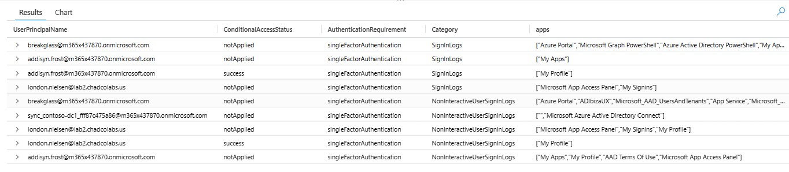
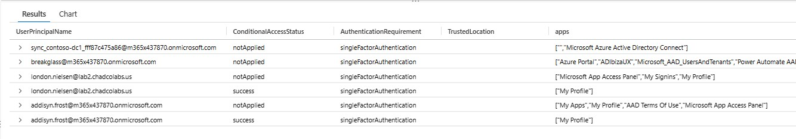
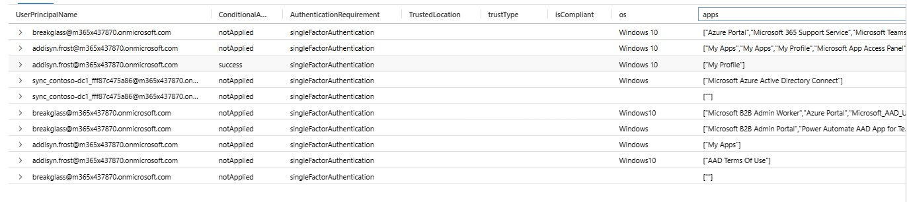
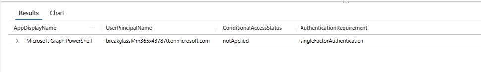
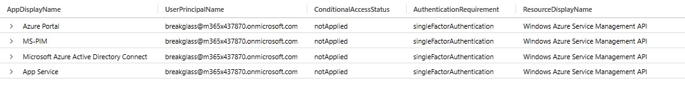
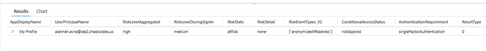
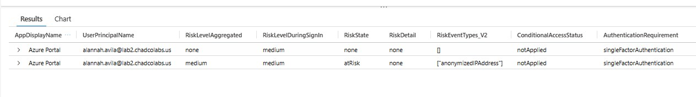
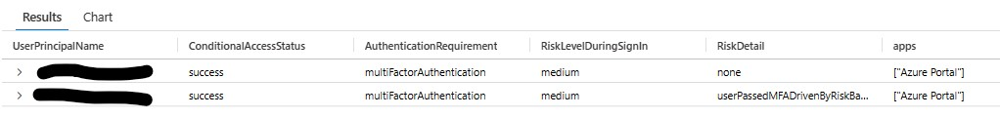
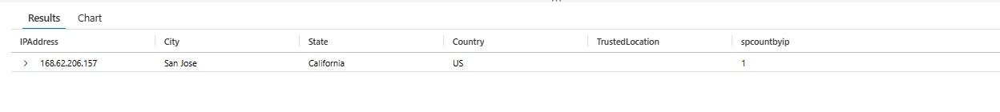

# Azure AD Conditional Access Policies
_Author: Chad Cox (Microsoft)_  
_Created: January 2023_  
_Updated: February 2023_  

**Disclaimer**
_This Sample Code is provided for the purpose of illustration only and is not
intended to be used in a production environment.  THIS SAMPLE CODE AND ANY
RELATED INFORMATION ARE PROVIDED "AS IS" WITHOUT WARRANTY OF ANY KIND, EITHER
EXPRESSED OR IMPLIED, INCLUDING BUT NOT LIMITED TO THE IMPLIED WARRANTIES OF
MERCHANTABILITY AND/OR FITNESS FOR A PARTICULAR PURPOSE.  We grant You a
nonexclusive, royalty-free right to use and modify the Sample Code and to
reproduce and distribute the object code form of the Sample Code, provided
that You agree: (i) to not use Our name, logo, or trademarks to market Your
software product in which the Sample Code is embedded; (ii) to include a valid
copyright notice on Your software product in which the Sample Code is embedded;
and (iii) to indemnify, hold harmless, and defend Us and Our suppliers from and
against any claims or lawsuits, including attorneys` fees, that arise or result
from the use or distribution of the Sample Code.._

**How to use this guide**
* Below is a list of Conditional Access Policies that Microsoft recommends in an Azure AD Tenant.
* Each link in the table of content contains information about a policy with notes about how to evaluate the impact of the policy.
* Use this method to shorten the amount of time it takes to deploy Conditional Access Policies in Azure AD, by proactively leveraging existing signinlogs and filtering to show the users that could be impacted.

**Table of Content**
* [Goals](https://github.com/chadmcox/Azure_AD_Conditional_Access_Policies#goals)
* [Requirements](https://github.com/chadmcox/Azure_AD_Conditional_Access_Policies#requirements)
* [Introduction](https://github.com/chadmcox/Azure_AD_Conditional_Access_Policies#introduction)
* [Find IPAddress not defined as trusted](https://github.com/chadmcox/Azure_AD_Conditional_Access_Policies#find-ipaddress-not-defined-as-trusted)
* [Applications not being protected by Conditional Access Policies](https://github.com/chadmcox/Azure_AD_Conditional_Access_Policies#applications-not-being-protected-by-conditional-access-policies)
* [Conditional Access Policies]()
  * [Default or Base MFA Policy]()
    * [Option 1: Always require MFA](https://github.com/chadmcox/Azure_AD_Conditional_Access_Policies#always-require-mfa)
    * [Option 2: Always require MFA from untrusted networks](https://github.com/chadmcox/Azure_AD_Conditional_Access_Policies#always-require-mfa-from-untrusted-networks)
    * [Option 3: Always require MFA or Trusted Device or Compliant Device](https://github.com/chadmcox/Azure_AD_Conditional_Access_Policies#always-require-mfa-or-trusted-device-or-compliant-device)
    * [Option 4: Always require MFA or Trusted Device or Compliant Device from untrusted networks](https://github.com/chadmcox/Azure_AD_Conditional_Access_Policies#always-require-mfa-or-trusted-device-or-compliant-device-from-untrusted-networks)
  * [Require MFA for Microsoft Graph PowerShell and Explorer](https://github.com/chadmcox/Azure_AD_Conditional_Access_Policies#require-mfa-for-microsoft-graph-powershell-and-explorer)
  * [Require MFA for Microsoft Azure Management](https://github.com/chadmcox/Azure_AD_Conditional_Access_Policies#require-mfa-for-microsoft-azure-management)
  * [Require privileged user to MFA](https://github.com/chadmcox/Azure_AD_Conditional_Access_Policies#require-privileged-user-to-mfa)
  * [Block Legacy Authentication](https://github.com/chadmcox/Azure_AD_Conditional_Access_Policies#block-legacy-authentication)
    * [Block privileged user from legacy authentication](https://github.com/chadmcox/Azure_AD_Conditional_Access_Policies#block-privileged-user-from-legacy-authentication)
    * [Block clients that do not support modern authentication](https://github.com/chadmcox/Azure_AD_Conditional_Access_Policies#block-clients-that-do-not-support-modern-authentication)
  * [Block the Directory Sync Account from non trusted locations](https://github.com/chadmcox/Azure_AD_Conditional_Access_Policies#block-the-directory-sync-account-from-non-trusted-locations)
  * [Block Guest from Azure Management](https://github.com/chadmcox/Azure_AD_Conditional_Access_Policies#block-guest-from-azure-management)
  * [Require guest to MFA](https://github.com/chadmcox/Azure_AD_Conditional_Access_Policies#require-guest-to-mfa)
  * [Require Compliant Device for Office 365](https://github.com/chadmcox/Azure_AD_Conditional_Access_Policies#require-compliant-device-for-office-365)
  * [No Persistent Browser and 1 Hour Session for Unmanaged Devices](https://github.com/chadmcox/Azure_AD_Conditional_Access_Policies#no-persistent-browser-and-1-hour-session-for-unmanaged-devices)
  * [Require privileged user to use compliant device](https://github.com/chadmcox/Azure_AD_Conditional_Access_Policies#require-privileged-user-to-use-compliant-device)
  * [Identity Protection Risk Policies]()
    * [Block when user risk is high](https://github.com/chadmcox/Azure_AD_Conditional_Access_Policies#block-when-user-risk-is-high)
    * [Block when sign-in risk is high](https://github.com/chadmcox/Azure_AD_Conditional_Access_Policies#block-when-sign-in-risk-is-high)
    * [Require MFA when sign-in risk is low, medium, or high](https://github.com/chadmcox/Azure_AD_Conditional_Access_Policies#require-mfa-when-sign-in-risk-is-low-medium-or-high)
    * [Block when privileged users user risk is low medium high](https://github.com/chadmcox/Azure_AD_Conditional_Access_Policies#block-when-privileged-role-member-user-risk-is-low-medium-high)
    * [Block when privileged user sign in risk is low medium high](https://github.com/chadmcox/Azure_AD_Conditional_Access_Policies#block-when-privileged-user-sign-in-risk-is-low-medium-high)
    * [Block when Directory Sync Account sign in risk is low medium high](https://github.com/chadmcox/Azure_AD_Conditional_Access_Policies#block-when-directory-sync-account-sign-in-risk-is-low-medium-high)
    * [Block Guest for Low, Medium and High Sign-in Risk](https://github.com/chadmcox/Azure_AD_Conditional_Access_Policies#block-guest-for-low-medium-and-high-sign-in-risk)
  * [Work Identity Policies]()
    * [Block Service Principal from Non Trusted Networks](https://github.com/chadmcox/Azure_AD_Conditional_Access_Policies#block-service-principal-from-non-trusted-networks)
    * [Block Service Principal with High Medium Low Risk](https://github.com/chadmcox/Azure_AD_Conditional_Access_Policies#block-service-principal-with-high-medium-low-risk)
* [References](https://github.com/chadmcox/Azure_AD_Conditional_Access_Policies#references)

### Goals
* Protect Privileged Credentials
* Require trusted devices
* Do not depend on trusted networks / locations
* Always require multifactor
* Minimize the use of filters
* Know the potential impact of a policy.
---
### Requirements
* The best way to do this is sending the Azure AD Sign In Logs to Azure Monitor (LogAnalytics).
  * Instructions on how to set up: [Integrate Azure AD logs with Azure Monitor logs](https://learn.microsoft.com/en-us/azure/active-directory/reports-monitoring/howto-integrate-activity-logs-with-log-analytics)
* Azure AD Premium 1 License are required for:
  * Conditional Access Policies
  * Sign in Logs to be sent to Log Analytics
  * Ability to query Sign in logs via microsoft graph
* **If a third party IDP or ADFS is used to federate the tenant, it must send the multiauthn claim when it performs mfa, so that Azure AD knows a mfa was performed and is reflcted in the logs.** Here is more info about the settings that needs to be done for this: [Set federatedIdpMfaBehavior to enforceMfaByFederatedIdp](https://learn.microsoft.com/en-us/azure/active-directory/authentication/how-to-migrate-mfa-server-to-azure-mfa-with-federation#set-federatedidpmfabehavior-to-enforcemfabyfederatedidp).  Without this data the queries will not provide to much value.
* Risk Policies require P2 License.
* Workload Identity License is required to view those risk.   

---
### Introduction
A few months back I was going through some documents and noticed several important conditional access policies that are usually missed.  (link to the document
[Zero Trust identity and device access configurations](https://learn.microsoft.com/en-us/microsoft-365/security/office-365-security/microsoft-365-policies-configurations)).  

While working with organization to determine impact by using read only and the built-in reporting, I was finding this was taking longer than expected and could be done much easier. I have thrown together a few PowerShell Scripts and Log Analytics Queries (KQL) that will help identify potential impact when a particular policy is applied.  

Not everything here is perfect and is being updated as I learn new things or new guidance becomes published.  Also do not hesitate to comment and let me know what is not working or is working.   

---
### How to run a Log Analytics Query


---
### How to create a Conditional Access Policy in Azure AD


---

### Find IPAddress not defined as trusted
**Log Analytics AAD SigninLogs Query (KQL)**
```
SigninLogs
| where TimeGenerated > ago(30d)
| where ResultType == "0"
| where HomeTenantId == ResourceTenantId
| where NetworkLocationDetails !contains "trustedNamedLocation"
| extend TrustedLocation = tostring(iff(NetworkLocationDetails contains 'trustedNamedLocation', 'trustedNamedLocation',''))
| extend isIPv6 = tostring(iff(IPAddress matches regex @"(([\d|\w]{1,4}\:){7}[\d|\w]{1,4})",'Yes','No'))
| distinct IPAddress, TrustedLocation, UserPrincipalName, isIPv6
| summarize uniqueusercountbyip = count() by IPAddress, TrustedLocation, isIPv6
| where uniqueusercountbyip >= 4
| sort by uniqueusercountbyip desc 
```

**Comment**  

This query returns IP addresses where 4 or more unique users have authenticated against Azure AD.  You will want to research each IP and determine if they are owned by the organization or if they belong to something like a public proxy cloud solution like zscaler or umbrella.  Legit ones will need to be defined as a trusted network in Azure AD to make sure any location filtered policy works correctly and to help remediate false positives in Azure Identity Protection

The field uniqueusercountbyip is count of unique list of users.
It is possible to see ipv6 addresses which usually comes from Azure Networks and will be normal in the near future from the internet.

   

---
### Applications not being protected by Conditional Access Policies
**Log Analytics AAD SigninLogs Query (KQL)**
```
//https://github.com/reprise99/Sentinel-Queries/blob/main/Azure%20Active%20Directory/Identity-Top20AppswithnoCA.kql
//This query shows applications that are not protected by conditional access policies.
let apps=
    SigninLogs
    | where TimeGenerated > ago (30d)
    | project TimeGenerated, ConditionalAccessPolicies, AppDisplayName
//Exclude native Microsoft apps that you can't enforce policy on or that are covered natively in Office 365
    | where AppDisplayName !in ("Microsoft Office Web Apps Service", "Microsoft App Access Panel", "Office Online Core SSO", "Microsoft Authentication Broker", "Microsoft Account Controls V2", "Microsoft 365 Support Service","Office Online Maker SSO","My Apps","My Profile")
    | mv-expand ConditionalAccessPolicies
    | extend CAResult = tostring(ConditionalAccessPolicies.result)
    | summarize ResultSet=make_set(CAResult) by AppDisplayName
    | where ResultSet !has "success" or ResultSet !has "failure"
    | project AppDisplayName;
SigninLogs
| where TimeGenerated > ago(30d)
| where ResultType == 0
| where AppDisplayName in (apps)
| summarize Count=count()by AppDisplayName
| top 20 by Count

```

**Comment**  
The image below, shows the applications and the logon count of those apps that is not being protected by some sort of Conditional Access Policy. Ideally every application will have a mfa requirement or a trusted/compliant policy requirement.  

   

---
### Always require MFA
* Link to Microsoft Documentation: [Common Conditional Access policy: Require MFA for all users](https://learn.microsoft.com/en-us/azure/active-directory/conditional-access/howto-conditional-access-policy-all-users-mfa)  
* This policy will require all users logging into any application to MFA.  

**Conditional Access Policy Setup**
* Create Conditional Access Policy:
* Users
  * Include: All Users
  * Exclude: Breakglass, _Exclusion Group_, Directory Role (Directory Sync Accounts), Guest
* Cloud Apps or Actions
  * Select what this policy applies to: Cloud apps
  * Include: All Cloud Apps
  * Exclude: Windows Store
* Conditions
* Grant
  * Grant Access
  * Require Multi-Factor Authentication
  * Require all the selected controls  

_Note: this policy will more than likely break on premise sync accounts, make sure the Directory Sync Accounts Role is in the exclusion group._  

**Log Analytics AAD SigninLogs Query (KQL)**
```
let excludeapps = pack_array("Windows Sign In","Microsoft Authentication Broker","Microsoft Account Controls V2","Microsoft Intune Company Portal","Microsoft Mobile Application Management");
//get an array of guest accounts to exclude from the non interactive logs
let guests = SigninLogs
| where TimeGenerated > ago(14d) and UserType == "Guest" and ResultType == 0 
| where AppDisplayName  !in (excludeapps)
| distinct UserPrincipalName;
AADNonInteractiveUserSignInLogs 
| where TimeGenerated > ago(14d)
| where HomeTenantId == ResourceTenantId and UserPrincipalName !in (guests)
| union SigninLogs 
| where TimeGenerated > ago(14d) 
| where UserType <> "Guest" 
| where ResultType == 0 and AuthenticationRequirement == "singleFactorAuthentication" 
| where AppDisplayName  !in (excludeapps)
| distinct AppDisplayName,UserPrincipalName,ConditionalAccessStatus,AuthenticationRequirement, Category 
| summarize apps=make_list(AppDisplayName) by UserPrincipalName,ConditionalAccessStatus,AuthenticationRequirement,Category
```

**Comment**  
This policy is a harder policy to implement.  This query will return a unique list of users and applications that are not hitting up against a conditional access policy and not providing multifactor authentication.  Things to look for in the KQL results are applications that might have problems like the Windows Store and accounts that need to be excluded such as faceless user objects or "service accounts".  

Expect to see most of the users in a org in this list.  The goal is to find the users and applications that need to be excluded because it would cause impact.

Looking at the image below.  I would make sure to exclude the breakglass account and the sync account as those are accounts that should not have this policy applied to it.  

   

---
### Always require MFA from untrusted networks
* Link to Microsoft Documentation: [Common Conditional Access policy: Require MFA for all users](https://learn.microsoft.com/en-us/azure/active-directory/conditional-access/howto-conditional-access-policy-all-users-mfa)  
* This policy will require all users logging into any application to MFA when signing in from networks not flagged as trusted.  

**Conditional Access Policy Setup**
* Create Conditional Access Policy:
* Users
  * Include: All Users
  * Exclude: Breakglass, _Exclusion Group_, Directory Role (Directory Sync Accounts), Guest
* Cloud Apps or Actions
  * Select what this policy applies to: Cloud apps
  * Include: All Cloud Apps
  * Exclude: Windows Store
* Conditions
  * Locations
  * Include: Any Location
  * Exclude: All trusted locations
* Grant
  * Grant Access
  * Require Multi-Factor Authentication
  * Require all the selected controls 

**Log Analytics AAD SigninLogs Query (KQL)**
```
//this query will show users that login from untrusted networks and only provide singlefactor authentication
//list of exclusion applications that seem to always have mfa
let excludeapps = pack_array("Windows Sign In","Microsoft Authentication Broker","Microsoft Account Controls V2","Microsoft Intune Company Portal","Microsoft Mobile Application Management");
//get an array of guest accounts to exclude from the non interactive logs
let guests = SigninLogs
| where TimeGenerated > ago(14d) and UserType == "Guest" and ResultType == 0 
| where AppDisplayName  !in (excludeapps)
| distinct UserPrincipalName;
AADNonInteractiveUserSignInLogs 
| where TimeGenerated > ago(14d)
| where HomeTenantId == ResourceTenantId and UserPrincipalName !in (guests)
| where NetworkLocationDetails !contains "trustedNamedLocation"
| extend TrustedLocation = tostring(iff(NetworkLocationDetails contains 'trustedNamedLocation', 'trustedNamedLocation','')) 
| union SigninLogs 
| where TimeGenerated > ago(14d) 
| where UserType <> "Guest" 
| where NetworkLocationDetails !contains "trustedNamedLocation"
| where ResultType == 0 and AuthenticationRequirement == "singleFactorAuthentication" 
| extend TrustedLocation = tostring(iff(NetworkLocationDetails contains 'trustedNamedLocation', 'trustedNamedLocation','')) 
| where AppDisplayName  !in (excludeapps)
| distinct AppDisplayName,UserPrincipalName,ConditionalAccessStatus,AuthenticationRequirement,TrustedLocation
| summarize apps=make_list(AppDisplayName) by UserPrincipalName,ConditionalAccessStatus,AuthenticationRequirement,TrustedLocation
```

**Comment**  
This policy is not required if you were able to implement: Always require MFA  
Also this policy has a network based filter which means if someone was able to "trick" the ip they would bypass important protections.  
This query will return a unique list of users and applications that are not hitting up against a conditional access policy and not providing multifactor authentication.  Things to look for in the KQL results are applications that might have problems like the Windows Store and accounts that need to be excluded such as faceless user objects or "service accounts".  

The goal is to find the users and applications that need to be excluded because it would cause impact. Also note if users are in this list that never access outside of the org then there is a good chance the IP that user is coming from is not trusted.  

Looking at the image below.  I would make sure to exclude the breakglass account from the policy and I would research the sync account to figure out why its being used outside a trusted network.  

   

---
### Always require MFA or Trusted Device or Compliant Device
* Link to Microsoft Documentation: [Common Conditional Access policy: Require a compliant device, hybrid Azure AD joined device, or multifactor authentication for all users](https://learn.microsoft.com/en-us/azure/active-directory/conditional-access/howto-conditional-access-policy-compliant-device)  

**Conditional Access Policy Setup**
* Create Conditional Access Policy:
* Users
  * Include: All Users
  * Exclude: Breakglass, _Exclusion Group_, Directory Role (Directory Sync Accounts), Guest
* Cloud Apps or Actions
  * Select what this policy applies to: Cloud apps
  * Include: All Cloud Apps
  * Exclude: Windows Store
* Conditions
* Grant
  * Grant Access
  * Require Multi-Factor Authentication,  Require Hybrid Azure AD joined device, and Require device to be marked as compliant
  * Require one of the selected controls

**Log Analytics AAD SigninLogs Query (KQL)**
```
//https://learn.microsoft.com/en-us/azure/active-directory/conditional-access/howto-conditional-access-policy-compliant-device
//Common Conditional Access policy: Require a compliant device, hybrid Azure AD joined device, or multifactor authentication for all users
//list of exclusion applications that seem to always have mfa
let excludeapps = pack_array("Windows Sign In","Microsoft Authentication Broker","Microsoft Account Controls V2","Microsoft Intune Company Portal","Microsoft Mobile Application Management");
//get an array of guest accounts to exclude from the non interactive logs
let guests = SigninLogs
| where TimeGenerated > ago(14d) and UserType == "Guest" and ResultType == 0 
| where AppDisplayName  !in (excludeapps)
| distinct UserPrincipalName;
//query the non interactive logs
let AADNon = AADNonInteractiveUserSignInLogs
| where TimeGenerated > ago(14d) and ResultType == 0 and AuthenticationRequirement == "singleFactorAuthentication" 
| where AppDisplayName  !in (excludeapps)
| where HomeTenantId == ResourceTenantId and UserPrincipalName !in (guests)
| extend trustType = tostring(parse_json(DeviceDetail).trustType) 
| extend isCompliant = tostring(parse_json(DeviceDetail).isCompliant) 
| extend TrustedLocation = tostring(iff(NetworkLocationDetails contains 'trustedNamedLocation', 'trustedNamedLocation',''))
| extend os = tostring(parse_json(DeviceDetail).operatingSystem) 
| where isCompliant <> 'true' and trustType <> "Hybrid Azure AD joined"  
| distinct AppDisplayName,UserPrincipalName,ConditionalAccessStatus,AuthenticationRequirement, TrustedLocation, trustType,isCompliant,os, Category;
//query the interactive logs
let AAD = SigninLogs 
| where TimeGenerated > ago(14d) and UserType <> "Guest" and ResultType == 0 and AuthenticationRequirement == "singleFactorAuthentication" 
| where AppDisplayName  !in (excludeapps) 
| extend trustType = tostring(DeviceDetail.trustType) 
| extend isCompliant = tostring(DeviceDetail.isCompliant) 
| extend os = tostring(DeviceDetail.operatingSystem) 
| extend TrustedLocation = tostring(iff(NetworkLocationDetails contains 'trustedNamedLocation', 'trustedNamedLocation',''))
| where isCompliant <> 'true' and trustType <> "Hybrid Azure AD joined"  
| distinct AppDisplayName,UserPrincipalName,ConditionalAccessStatus,AuthenticationRequirement, TrustedLocation, trustType,isCompliant,os,Category;
//combine the results
AADNon
| union AAD
| summarize apps=make_list(AppDisplayName) by UserPrincipalName,ConditionalAccessStatus,AuthenticationRequirement, TrustedLocation,trustType,isCompliant,os
```

**Comment**  
This policy is not required if you were able to implement: Always require MFA  
 

   

---
### Always require MFA or Trusted Device or Compliant Device from untrusted networks
* Link to Microsoft Documentation: [Common Conditional Access policy: Require a compliant device, hybrid Azure AD joined device, or multifactor authentication for all users](https://learn.microsoft.com/en-us/azure/active-directory/conditional-access/howto-conditional-access-policy-compliant-device)
* Link to Microsoft Documentation: [Named locations](https://learn.microsoft.com/en-us/azure/active-directory/conditional-access/howto-conditional-access-policy-all-users-mfa#named-locations)  
* This policy will require all trusted networks to be defined.

**Conditional Access Policy Setup**
* Create Conditional Access Policy:
* Users
  * Include: All Users
  * Exclude: Breakglass, _Exclusion Group_, Directory Role (Directory Sync Accounts), Guest
* Cloud Apps or Actions
  * Select what this policy applies to: Cloud apps
  * Include: All Cloud Apps
  * Exclude: Windows Store
* Conditions
  * Locations
  * Include: Any Location
  * Exclude: All trusted locations
* Grant
  * Grant Access
  * Require Multi-Factor Authentication,  Require Hybrid Azure AD joined device, and Require device to be marked as compliant
  * Require one of the selected controls

**Log Analytics AAD SigninLogs Query (KQL)**
```
let excludeapps = pack_array("Windows Sign In","Microsoft Authentication Broker","Microsoft Account Controls V2","Microsoft Intune Company Portal","Microsoft Mobile Application Management");
//get an array of guest accounts to exclude from the non interactive logs
let guests = SigninLogs
| where TimeGenerated > ago(14d) and UserType == "Guest" and ResultType == 0 
| where AppDisplayName  !in (excludeapps)
| distinct UserPrincipalName;
//query the non interactive logs
let AADNon = AADNonInteractiveUserSignInLogs
| where TimeGenerated > ago(14d) and ResultType == 0 and AuthenticationRequirement == "singleFactorAuthentication" 
| where AppDisplayName  !in (excludeapps)
| where HomeTenantId == ResourceTenantId and NetworkLocationDetails !contains "trustedNamedLocation" and UserPrincipalName !in (guests)
| extend trustType = tostring(parse_json(DeviceDetail).trustType) 
| extend isCompliant = tostring(parse_json(DeviceDetail).isCompliant) 
| extend TrustedLocation = tostring(iff(NetworkLocationDetails contains 'trustedNamedLocation', 'trustedNamedLocation',''))
| extend os = tostring(parse_json(DeviceDetail).operatingSystem) 
| where isCompliant <> 'true' and trustType <> "Hybrid Azure AD joined"  
| distinct AppDisplayName,UserPrincipalName,ConditionalAccessStatus,AuthenticationRequirement, TrustedLocation, trustType,isCompliant,os, Category;
//query the interactive logs
let AAD = SigninLogs 
| where TimeGenerated > ago(14d) and UserType <> "Guest" and ResultType == 0 and AuthenticationRequirement == "singleFactorAuthentication" 
| where AppDisplayName  !in (excludeapps) 
| where NetworkLocationDetails !contains "trustedNamedLocation"
| extend trustType = tostring(DeviceDetail.trustType) 
| extend isCompliant = tostring(DeviceDetail.isCompliant) 
| extend os = tostring(DeviceDetail.operatingSystem) 
| extend TrustedLocation = tostring(iff(NetworkLocationDetails contains 'trustedNamedLocation', 'trustedNamedLocation',''))
| where isCompliant <> 'true' and trustType <> "Hybrid Azure AD joined"  
| distinct AppDisplayName,UserPrincipalName,ConditionalAccessStatus,AuthenticationRequirement, TrustedLocation, trustType,isCompliant,os,Category;
//combine the results
AADNon
| union AAD
| summarize apps=make_list(AppDisplayName) by UserPrincipalName,ConditionalAccessStatus,AuthenticationRequirement, TrustedLocation,trustType,isCompliant,os
```

**Comment**  
This policy is not required if you were able to implement: Always require MFA  
 

  

---
### Require MFA for Microsoft Graph PowerShell and Explorer
* Link to Microsoft Documentation: [Blocking PowerShell for EDU Tenants](https://learn.microsoft.com/en-us/schooldatasync/blocking-powershell-for-edu)
* May not be available for China or Gov Cloud

**Conditional Access Policy Setup**
* Create Conditional Access Policy:
* Users
  * Include: All Users
  * Exclude: Breakglass, _Exclusion Group_
* Cloud Apps or Actions
  * Select what this policy applies to: Cloud Apps
  * Include: Microsoft Graph PowerShell, Graph Explorer
* Conditions
* Grant
  * Grant Access
  * Require Multi-Factor Authentication
  * Require all the selected controls

**Log Analytics AAD SigninLogs Query (KQL)**
```
let includeapps = pack_array("Graph Explorer","Microsoft Graph PowerShell");
AADNonInteractiveUserSignInLogs
| where TimeGenerated > ago(14d) and ResultType == 0 and AuthenticationRequirement == "singleFactorAuthentication"
| where AppDisplayName in (includeapps) 
| union SigninLogs
| where TimeGenerated > ago(14d) and ResultType == 0 and AuthenticationRequirement == "singleFactorAuthentication" 
| where AppDisplayName in (includeapps)
| distinct AppDisplayName, UserPrincipalName, ConditionalAccessStatus, AuthenticationRequirement
```

**Comment**  
This policy is great for organizations that have trusted network based filters on the base conditional access policy.  This will make sure users that use tools that can be used to perform queries or changes agaisnt the tenant must require MFA from both trusted and non trusted networks.   

Revew the list of users in the results. in the example image below, the breakglass account is the only account being used to signin to those end points.  That particular account should be excluded from the policy.  But also shouldnt be used.  Any other account such as possible service accounts used for azure ad automation will need to be excluded from the policy and should eventually transition to using a service principal instead.  

  

---
### Require MFA for Microsoft Azure Management
* Link to Microsoft Documentation: [Common Conditional Access policy: Require MFA for Azure management](https://learn.microsoft.com/en-us/azure/active-directory/conditional-access/howto-conditional-access-policy-azure-management) 
* This may not be available for Gov or China Tenant

**Conditional Access Policy Setup**
* Create Conditional Access Policy:
* Users
  * Include: All Users
  * Exclude: Breakglass, _Exclusion Group_
* Cloud Apps or Actions
  * Select what this policy applies to: Cloud Apps
  * Include: Microsoft Azure Management
* Conditions
* Grant
  * Grant Access
  * Require Multi-Factor Authentication
  * Require all the selected controls

**Log Analytics AAD SigninLogs Query (KQL)**
```
//https://learn.microsoft.com/en-us/azure/active-directory/conditional-access/howto-conditional-access-policy-azure-management
//Common Conditional Access policy: Require MFA for Azure management
let includeapps = pack_array("Windows Azure Service Management API");
AADNonInteractiveUserSignInLogs
| union SigninLogs
| where TimeGenerated > ago(14d) and ResultType == 0 and AuthenticationRequirement == "singleFactorAuthentication" 
| where  ResourceDisplayName in (includeapps)
| distinct AppDisplayName, UserPrincipalName, ConditionalAccessStatus, AuthenticationRequirement, ResourceDisplayName
```

**Comment**  
This policy is great for organizations that have trusted network based filters on the base conditional access policy.  This will make sure users that use tools that can be used to perform queries or changes against Azure subscriptions must require MFA from both trusted and non trusted networks.   

Revew the list of users in the results. in the example image below, the breakglass account is the only account being used to signin to those end points.  That particular account should be excluded from the policy.  But also shouldnt be used.  Any other account such as possible service accounts used for azure automation will need to be excluded from the policy and should eventually transition to using a service principal instead.
 
  

---
### Block Legacy Authentication
* Link to Microsoft Documentation: [Common Conditional Access policy: Block legacy authentication](https://learn.microsoft.com/en-us/azure/active-directory/conditional-access/howto-conditional-access-policy-block-legacy)  
* This policy will require 
* Ideally use a block over MFA

**Conditional Access Policy Setup**
* Create Conditional Access Policy:
* Users
  * Include: All Users
  * Exclude: Breakglass, _Exclusion Group_
* Cloud Apps or Actions
  * Select what this policy applies to: Cloud Apps
  * Include: All Cloud Apps
* Conditions
  * Client apps
  * Exchange ActiveSync clients
  * Other clients
* Grant
  * Block Access

**Log Analytics AAD SigninLogs Query (KQL)**
```
AADNonInteractiveUserSignInLogs
| union SigninLogs
| where TimeGenerated > ago(14d) and ResultType == 0
| extend ClientAppUsed = iff(isempty(ClientAppUsed) == true, "Unknown", ClientAppUsed)  
| extend isLegacyAuth = case(ClientAppUsed contains "Browser", "No", ClientAppUsed contains "Mobile Apps and Desktop clients", "No", ClientAppUsed contains "Exchange ActiveSync", "Yes", ClientAppUsed contains "Exchange Online PowerShell","Yes", ClientAppUsed contains "Unknown", "Unknown", "Yes") 
| where isLegacyAuth == "Yes"
| distinct UserDisplayName, UserPrincipalName, AppDisplayName, ClientAppUsed, isLegacyAuth, UserAgent, Category
```

**Comment**  
No example image to show what these results look like.  Review the results from the query which pulls from both the interactive and non interactive logs.  work with the users to remove the dependancy. The sooner this policy is in place the better.   
 
---
### Require privileged user to MFA
* Link to Microsoft Documentation: [Common Conditional Access policy: Require MFA for administrators](https://learn.microsoft.com/en-us/azure/active-directory/conditional-access/howto-conditional-access-policy-admin-mfa)  

**Conditional Access Policy Setup**
* Create Conditional Access Policy:
* Users
  * Include: Directory Roles (Application Administrator,Authentication Administrator,Cloud Application Administrator,Conditional Access Administrator,Exchange Administrator,Global Administrator,Helpdesk Administrator,Hybrid Identity Administrator,Password Administrator,Privileged Authentication Administrator,Privileged Role Administrator,Security Administrator,SharePoint Administrator,User Administrator)
  * Exclude: Breakglass, _Exclusion Group_
* Cloud Apps or Actions
  * Select what this policy applies to: Cloud apps
  * Include: All Cloud Apps
  * Exclude: None
* Conditions
* Grant
  * Grant Access
  * Require Multi-Factor Authentication
  * Require all the selected controls
* Session
  * Sign-in frequency 2 Hours

**Log Analytics AAD SigninLogs Query (KQL)**
```

```
**Log Analytics AAD SigninLogs and AuditLogs PIM Query (KQL)**
```
let privroles = pack_array("Application Administrator","Authentication Administrator","Cloud Application Administrator","Conditional Access Administrator","Exchange Administrator","Global Administrator","Helpdesk Administrator","Hybrid Identity Administrator","Password Administrator","Privileged Authentication Administrator","Privileged Role Administrator","Security Administrator","SharePoint Administrator","User Administrator");
let privusers = AuditLogs 
| where TimeGenerated > ago(60d) and ActivityDisplayName == 'Add member to role completed (PIM activation)' and Category == "RoleManagement" 
| extend Caller = tostring(InitiatedBy.user.userPrincipalName) 
| extend Role = tostring(TargetResources[0].displayName) 
| where Role in (privroles) 
| distinct Caller;
SigninLogs 
| where TimeGenerated > ago(14d) and UserPrincipalName in~ (privusers) and ResultType == 0 and AuthenticationRequirement == "singleFactorAuthentication" 
| where AppDisplayName  <> "Windows Sign In" and AppDisplayName <> "Microsoft Authentication Broker" and AppDisplayName <> 'Microsoft Account Controls V2' 
| distinct AppDisplayName,UserPrincipalName,ConditionalAccessStatus,AuthenticationRequirement, Category
```
**Sentinel AAD SigninLogs Query (KQL) requires UEBA turned on**
```

```

**Comment**  

---
### Block privileged user from legacy authentication
* Link to Microsoft Documentation: [Common Conditional Access policy: Block legacy authentication](https://learn.microsoft.com/en-us/azure/active-directory/conditional-access/howto-conditional-access-policy-block-legacy)  

**Conditional Access Policy Setup**
* Create Conditional Access Policy:
* Users
  * Include: Include: Directory Roles (Application Administrator,Authentication Administrator,Cloud Application Administrator,Conditional Access Administrator,Exchange Administrator,Global Administrator,Helpdesk Administrator,Hybrid Identity Administrator,Password Administrator,Privileged Authentication Administrator,Privileged Role Administrator,Security Administrator,SharePoint Administrator,User Administrator)
  * Exclude: Breakglass, _Exclusion Group_
* Cloud Apps or Actions
  * Select what this policy applies to: Cloud apps
  * Include: All Cloud Apps
  * Exclude: None
* Conditions
  * Client apps
    * Exchange ActiveSync clients
    * Other clients
* Grant
  * Block Access

**Log Analytics AAD SigninLogs Query (KQL)**
```

```
**Log Analytics AAD SigninLogs and AuditLogs PIM Query (KQL)**
```
let privroles = pack_array("Application Administrator","Authentication Administrator","Cloud Application Administrator","Conditional Access Administrator","Exchange Administrator","Global Administrator","Helpdesk Administrator","Hybrid Identity Administrator","Password Administrator","Privileged Authentication Administrator","Privileged Role Administrator","Security Administrator","SharePoint Administrator","User Administrator");
let privusers = AuditLogs 
| where TimeGenerated > ago(60d) and ActivityDisplayName == 'Add member to role completed (PIM activation)' and Category == "RoleManagement" 
| extend Caller = tostring(InitiatedBy.user.userPrincipalName) 
| extend Role = tostring(TargetResources[0].displayName) 
| where Role in (privroles) 
| distinct Caller;
SigninLogs 
| where TimeGenerated > ago(14d) and UserPrincipalName in~ (privusers) and ResultType == 0 
| extend ClientAppUsed = iff(isempty(ClientAppUsed) == true, "Unknown", ClientAppUsed)  
| extend isLegacyAuth = case(ClientAppUsed contains "Browser", "No", ClientAppUsed contains "Mobile Apps and Desktop clients", "No", ClientAppUsed contains "Exchange ActiveSync", "Yes", ClientAppUsed contains "Exchange Online PowerShell","Yes", ClientAppUsed contains "Unknown", "Unknown", "Yes") 
| where isLegacyAuth == "Yes"
| distinct AppDisplayName,UserPrincipalName,ConditionalAccessStatus,AuthenticationRequirement, isLegacyAuth
```
**Sentinel AAD SigninLogs Query (KQL) requires UEBA turned on**
```

```

**Comment**  


---
### Block the Directory Sync Account from non trusted locations
* Link to Microsoft Documentation: [Named locations](https://learn.microsoft.com/en-us/azure/active-directory/conditional-access/howto-conditional-access-policy-all-users-mfa#named-locations) 
* Requires Named Locations to be created and trusted

**Conditional Access Policy Setup**
* Create Conditional Access Policy:
* Users
  * Include: Directory Role (Directory Sync Account)
  * Exclude: Breakglass, _Exclusion Group_
* Cloud Apps or Actions
  * Select what this policy applies to: Cloud apps
  * Include: All Cloud Apps
  * Exclude: None
* Conditions
  * Locations
  * Include: Any Location
  * Exclude: All trusted locations
* Grant
  * Block Access

**Log Analytics AAD SigninLogs Query (KQL)**
```
AADNonInteractiveUserSignInLogs 
| union SigninLogs 
| where TimeGenerated > ago(14d) 
| where UserPrincipalName startswith "Sync_" 
| extend TrustedLocation = tostring(iff(NetworkLocationDetails contains 'trustedNamedLocation', 'trustedNamedLocation','')) 
| distinct IPAddress, TrustedLocation, UserPrincipalName
```

**Comment**  


---
### Block Guest from Azure Management
* Link to Microsoft Documentation: [Common Conditional Access policy: Require MFA for Azure management](https://learn.microsoft.com/en-us/azure/active-directory/conditional-access/howto-conditional-access-policy-azure-management)   
* Link to Microsoft Documentation: [Conditional Access: Block access](https://learn.microsoft.com/en-us/azure/active-directory/conditional-access/howto-conditional-access-policy-block-access)  

**Conditional Access Policy Setup**
* Create Conditional Access Policy:
* Users
  * Include: All guest and external users
  * Exclude: Breakglass, _Exclusion Group_
* Cloud Apps or Actions
  * Select what this policy applies to: Cloud apps
  * Include: Microsoft Azure Management
  * Exclude: None
* Conditions
* Grant
  * Block Access

**Log Analytics AAD SigninLogs Query (KQL)**
```
let includeapps = pack_array("Windows Azure Service Management API");
SigninLogs
| where TimeGenerated > ago(14d) and ResultType == 0 and AuthenticationRequirement == "singleFactorAuthentication" 
| where  ResourceDisplayName in (includeapps)
| where AADTenantId <> HomeTenantId
| distinct AppDisplayName, UserPrincipalName, ConditionalAccessStatus, AuthenticationRequirement, ResourceDisplayName
```

**Comment**  


---
### Require guest to MFA
* Link to Microsoft Documentation: [change me]()  

**Conditional Access Policy Setup**
* Create Conditional Access Policy:
* Users
  * Include: Guest
  * Exclude: Breakglass, _Exclusion Group_
* Cloud Apps or Actions
  * Select what this policy applies to: Cloud apps
  * Include: All Cloud Apps
  * Exclude: None
* Conditions
* Grant
  * Grant Access
  * Require Multi-Factor Authentication
  * Require all the selected controls

**Log Analytics AAD SigninLogs Query (KQL)**
```
// URL: https://learn.microsoft.com/en-us/azure/active-directory/external-identities/b2b-tutorial-require-mfa
SigninLogs 
| where TimeGenerated > ago(14d) and UserType == "Guest" 
| where ResultType == 0 and AuthenticationRequirement == "singleFactorAuthentication" 
| where AADTenantId <> HomeTenantId
| distinct AppDisplayName,UserPrincipalName,ConditionalAccessStatus,AuthenticationRequirement,Category 
| summarize apps=make_list(AppDisplayName) by UserPrincipalName,ConditionalAccessStatus,AuthenticationRequirement, Category
```

**Comment**  


---
### Require Compliant Device for Office 365
* Link to Microsoft Documentation: [change me]()  
* This policy will require 
* Ideally use a block over MFA

**Conditional Access Policy Setup**
* Create Conditional Access Policy:


**Log Analytics AAD SigninLogs Query (KQL)**
```

```

**Comment**  


---
### No Persistent Browser and 1 Hour Session for Unmanaged Devices
* Link to Microsoft Documentation: [Common Conditional Access policy: Require reauthentication and disable browser persistence](https://learn.microsoft.com/en-us/azure/active-directory/conditional-access/howto-policy-persistent-browser-session)  

**Conditional Access Policy Setup**
* Create Conditional Access Policy:
* Users
  * Include: All Users
  * Exclude: Breakglass, _Exclusion Group_,
* Cloud Apps or Actions
  * Select what this policy applies to: Cloud apps
  * Include: All cloud apps
  * Exclude: None
* Conditions
   * Filter for device
   * device.isCompliant -ne True -or device.trustType -ne "ServerAD"
* Session
  * Sign-in frequency: 1 Hour
  * Persistent browser session: Never persistent

**Log Analytics AAD SigninLogs Query (KQL)**
```
SigninLogs 
| where TimeGenerated > ago(14d) and ResultType == 0 and UserType <> "Guest" 
| extend trustType = tostring(DeviceDetail.trustType) 
| extend isCompliant = tostring(DeviceDetail.isCompliant) 
| extend deviceName = tostring(DeviceDetail.displayName) 
| extend os = tostring(DeviceDetail.operatingSystem) 
| extend TrustedLocation = tostring(iff(NetworkLocationDetails contains 'trustedNamedLocation', 'trustedNamedLocation','')) 
| where isCompliant <> 'true' and trustType <> "Hybrid Azure AD joined" and ClientAppUsed == "Browser" 
| distinct UserPrincipalName, os, deviceName, trustType, isCompliant, TrustedLocation
```

**Comment**  


---
### Block clients that do not support modern authentication
* Link to Microsoft Documentation: [Common Conditional Access policy: Block legacy authentication](https://learn.microsoft.com/en-us/azure/active-directory/conditional-access/howto-conditional-access-policy-block-legacy)  

**Conditional Access Policy Setup**
* Create Conditional Access Policy:
* Users
  * Include: All Users
  * Exclude: Breakglass, _Exclusion Group_
* Cloud Apps or Actions
  * Select what this policy applies to: Cloud Apps
  * Include: All Cloud Apps
* Conditions
  * Client apps
  * Exchange ActiveSync clients
  * Other clients
* Grant
  * Block Access

**Log Analytics AAD SigninLogs Query (KQL)**
```
AADNonInteractiveUserSignInLogs
| union SigninLogs
| where TimeGenerated > ago(14d) and ResultType == 0
| extend ClientAppUsed = iff(isempty(ClientAppUsed) == true, "Unknown", ClientAppUsed)  
| extend isLegacyAuth = case(ClientAppUsed contains "Browser", "No", ClientAppUsed contains "Mobile Apps and Desktop clients", "No", ClientAppUsed contains "Exchange ActiveSync", "Yes", ClientAppUsed contains "Exchange Online PowerShell","Yes", ClientAppUsed contains "Unknown", "Unknown", "Yes") 
| where isLegacyAuth == "Yes"
| distinct UserDisplayName, UserPrincipalName, AppDisplayName, ClientAppUsed, isLegacyAuth, UserAgent, Category
```

**Comment**  


---
### Require privileged user to use compliant device
* Link to Microsoft Documentation: [Common Conditional Access policy: Require compliant or hybrid Azure AD joined device for administrators](https://learn.microsoft.com/en-us/azure/active-directory/conditional-access/howto-conditional-access-policy-compliant-device-admin)  
* This policy will require Intune

**Conditional Access Policy Setup**
* Create Conditional Access Policy:
* Users
  * Include: Directory Roles (Application Administrator,Authentication Administrator,Cloud Application Administrator,Conditional Access Administrator,Exchange Administrator,Global Administrator,Helpdesk Administrator,Hybrid Identity Administrator,Password Administrator,Privileged Authentication Administrator,Privileged Role Administrator,Security Administrator,SharePoint Administrator,User Administrator)
  * Exclude: Breakglass, _Exclusion Group_
* Cloud Apps or Actions
  * Select what this policy applies to: Cloud apps
  * Include: All Cloud Apps
  * Exclude: None
* Conditions
* Grant
  * Grant Access
  * Require device to be marked as compliant
  * Require Hybrid Azure AD joined device
  * Require one of the selected controls

**Log Analytics AAD SigninLogs Query (KQL)**
```

```
**Log Analytics AAD SigninLogs and AuditLogs PIM Query (KQL)**
```
let privroles = pack_array("Application Administrator","Authentication Administrator","Cloud Application Administrator","Conditional Access Administrator","Exchange Administrator","Global Administrator","Helpdesk Administrator","Hybrid Identity Administrator","Password Administrator","Privileged Authentication Administrator","Privileged Role Administrator","Security Administrator","SharePoint Administrator","User Administrator");
let privusers = AuditLogs 
| where TimeGenerated > ago(60d) and ActivityDisplayName == 'Add member to role completed (PIM activation)' and Category == "RoleManagement" 
| extend Caller = tostring(InitiatedBy.user.userPrincipalName) 
| extend Role = tostring(TargetResources[0].displayName) 
| where Role in (privroles) 
| distinct Caller;
SigninLogs 
| where TimeGenerated > ago(14d) and UserPrincipalName in~ (privusers) and ResultType == 0 
| extend trustType = tostring(parse_json(DeviceDetail).trustType) 
| extend isCompliant = tostring(parse_json(DeviceDetail).isCompliant) 
| extend TrustedLocation = tostring(iff(NetworkLocationDetails contains 'trustedNamedLocation', 'trustedNamedLocation',''))
| extend os = tostring(parse_json(DeviceDetail).operatingSystem) 
| where isCompliant <> 'true' and trustType <> "Hybrid Azure AD joined"  
| distinct AppDisplayName,UserPrincipalName,ConditionalAccessStatus,AuthenticationRequirement, TrustedLocation, trustType,isCompliant,os, Category
```
**Sentinel AAD SigninLogs Query (KQL) requires UEBA turned on**
```

```

**Comment**  

---
### Block when user risk is high
* Link to Microsoft Documentation: [Common Conditional Access policy: User risk-based password change](https://learn.microsoft.com/en-us/azure/active-directory/conditional-access/howto-conditional-access-policy-risk-user)  
* This policy will require 
* Ideally use a block over Change Password

**Conditional Access Policy Setup**
* Create Conditional Access Policy:
* Users
  * Include: All Users
  * Exclude: Guests, Breakglass, _Exclusion Group_
* Cloud Apps or Actions
  * Select what this policy applies to: Cloud apps
  * Include: All Cloud Apps
  * Exclude: None
* Conditions
  * User risk: High
* Grant
  * Block Access
* Session
  * Sign-in frequency
  * Every time

**Log Analytics AAD SigninLogs Query (KQL)**
```
SigninLogs 
| where TimeGenerated > ago(14d) 
| where RiskState == "atRisk" and RiskLevelAggregated == "high"
| project AppDisplayName, UserPrincipalName, RiskLevelAggregated, RiskLevelDuringSignIn, RiskState, RiskDetail,IsRisky, RiskEventTypes_V2, MfaDetail, ConditionalAccessStatus, AuthenticationRequirement, ResultType
```

**Comment**  
Having two conditional access policies one blocking high sign-in risk and one blocking high user risk is really important.  The image below shows the importance of this.  I took a user and logged into a tenant with a tor browser, This action alone only had a sign in risk of medium.  Next I went to add a MFA into my profile and immediately the user risk went up to high and would have instantly blocked me if the policy was enabled preventing the "bad actor" from registering their own MFA creds.

 

---
### Block when sign-in risk is high
* Link to Microsoft Documentation: [Common Conditional Access policy: Sign-in risk-based multifactor authentication](https://learn.microsoft.com/en-us/azure/active-directory/conditional-access/howto-conditional-access-policy-risk)  
* This policy will require 
* Ideally use a block over MFA

**Conditional Access Policy Setup**
* Create Conditional Access Policy:
* Users
  * Include: All Users
  * Exclude: Guest, Breakglass, _Exclusion Group_
* Cloud Apps or Actions
  * Select what this policy applies to: Cloud apps
  * Include: All Cloud Apps
  * Exclude: None
* Conditions
  * Sign-in risk: High
* Grant
  * Block Access
* Session
  * Sign-in frequency
  * Every time

**Log Analytics AAD SigninLogs Query (KQL)**
```
SigninLogs 
| where TimeGenerated > ago(14d) and ResultType == 0 and UserType <> "Guest"
| where RiskLevelDuringSignIn in ("high") 
| project ResultType, ResultDescription,AppDisplayName, UserPrincipalName, RiskLevelAggregated, RiskLevelDuringSignIn, RiskState, RiskDetail, RiskEventTypes_V2, ConditionalAccessStatus, AuthenticationRequirement
```

**Comment**  
Microsoft documents say to require the user to MFA, But all of Microsoft actual security documents say that this should be a block instead.  From personal experience and the guidance from the lapsus incidents is that this needs be a block action.  Specially if spammable MFA is present and who knows what admins could be easily convinced to accept a mfa prompt for a price.  

No image available, the results to this will be very similiar to the results from the Require MFA when sign-in risk is low, medium, or high query.  The users with a high sign-in risk will be blocked.  The goal will be to have a user adjust how they are logging in to make sure it does not come in as high.  An orgonization should not want to leverage any exclusion on this and I find that most orgs have no issues putting this one in place.


---
### Require MFA when sign-in risk is low, medium, or high
* Link to Microsoft Documentation: [change me]()  
* This policy will require 
* Ideally use a block over Change Password.

**Conditional Access Policy Setup**
* Create Conditional Access Policy:
* Users
  * Include: All Users
  * Exclude: Guest, Breakglass, _Exclusion Group_
* Cloud Apps or Actions
  * Select what this policy applies to: Cloud apps
  * Include: All Cloud Apps
  * Exclude: None
* Conditions
  * Sign-in risk: High, Medium, Low
* Grant
  * Require MFA
* Session
  * Sign-in frequency
  * Every time

**Log Analytics AAD SigninLogs Query (KQL)**
```
SigninLogs 
| where TimeGenerated > ago(14d) and ResultType == 0 and UserType <> "Guest"
| where RiskLevelDuringSignIn in ("high","medium","low") 
| distinct AppDisplayName, UserPrincipalName, RiskLevelAggregated, RiskLevelDuringSignIn, RiskState, RiskDetail, RiskEventTypes_V2, ConditionalAccessStatus, AuthenticationRequirement
```

**Comment**  
This policy will require anyone with a risky sign-in to have to provide mfa, The High will be blocked due to the other policy so the mfa will only occur for low and medium.  The image below is an example of the results, It will more than likely be a lot more users in an actual production tenant.  

 

---
### Block when privileged role member user risk is low medium high
* Link to Microsoft Documentation: [change me]()  
* This policy will require 
* Ideally use a block over MFA

**Conditional Access Policy Setup**
* Create Conditional Access Policy:
* Users
  * Include: Directory Roles (Application Administrator,Authentication Administrator,Cloud Application Administrator,Conditional Access Administrator,Exchange Administrator,Global Administrator,Helpdesk Administrator,Hybrid Identity Administrator,Password Administrator,Privileged Authentication Administrator,Privileged Role Administrator,Security Administrator,SharePoint Administrator,User Administrator)
  * Exclude: Breakglass, _Exclusion Group_
* Cloud Apps or Actions
  * Select what this policy applies to: Cloud apps
  * Include: All Cloud Apps
  * Exclude: None
* Conditions
  * User risk: High, Medium, Low
* Grant
  * Block Access
* Session
  * Sign-in frequency
  * Every time

**Log Analytics AAD SigninLogs Query (KQL)**
```

```
**Log Analytics AAD SigninLogs and AuditLogs PIM Query (KQL)**
```
let privroles = pack_array("Application Administrator","Authentication Administrator","Cloud Application Administrator","Conditional Access Administrator","Exchange Administrator","Global Administrator","Helpdesk Administrator","Hybrid Identity Administrator","Password Administrator","Privileged Authentication Administrator","Privileged Role Administrator","Security Administrator","SharePoint Administrator","User Administrator");
let privusers = AuditLogs 
| where TimeGenerated > ago(60d) and ActivityDisplayName == 'Add member to role completed (PIM activation)' and Category == "RoleManagement" 
| extend Caller = tostring(InitiatedBy.user.userPrincipalName) 
| extend Role = tostring(TargetResources[0].displayName) 
| where Role in (privroles) 
| distinct Caller;
SigninLogs 
| where TimeGenerated > ago(14d) and UserPrincipalName in~ (privusers) and RiskLevelAggregated in ("high","medium","low") 
| project AppDisplayName, UserPrincipalName, RiskLevelAggregated, RiskLevelDuringSignIn, RiskState, RiskDetail, RiskEventTypes_V2, ConditionalAccessStatus, AuthenticationRequirement, Category

```
**Sentinel AAD SigninLogs Query (KQL) requires UEBA turned on**
```

```

**Comment**  

---
### Block when privileged role member sign in risk is low medium high
* Link to Microsoft Documentation: [change me]()  
* This policy will require Premium License 2
* Ideally use a block over MFA

**Conditional Access Policy Setup**
* Create Conditional Access Policy:
* Users
  * Include: Directory Roles (Application Administrator,Authentication Administrator,Cloud Application Administrator,Conditional Access Administrator,Exchange Administrator,Global Administrator,Helpdesk Administrator,Hybrid Identity Administrator,Password Administrator,Privileged Authentication Administrator,Privileged Role Administrator,Security Administrator,SharePoint Administrator,User Administrator)
  * Exclude: Breakglass, _Exclusion Group_
* Cloud Apps or Actions
  * Select what this policy applies to: Cloud apps
  * Include: All Cloud Apps
  * Exclude: None
* Conditions
  * Sign-in risk: High, Medium, Low
* Grant
  * Block Access
* Session
  * Sign-in frequency
    * Every time

**Log Analytics AAD SigninLogs Query (KQL)**
```

```
**Log Analytics AAD SigninLogs and AuditLogs PIM Query (KQL)**
```
//https://github.com/chadmcox/Azure_Active_Directory/blob/master/Log%20Analytics/Conditional%20Access%20Policy%20Impact%20KQL/Possible%20impact%20of%20Block%20privileged%20user%20if%20sign-in%20risk%20is%20low%20medium%20or%20high.kql
let privroles = pack_array("Application Administrator","Authentication Administrator","Cloud Application Administrator","Conditional Access Administrator","Exchange Administrator","Global Administrator","Helpdesk Administrator","Hybrid Identity Administrator","Password Administrator","Privileged Authentication Administrator","Privileged Role Administrator","Security Administrator","SharePoint Administrator","User Administrator");
let privusers = AuditLogs 
| where TimeGenerated > ago(60d) and ActivityDisplayName == 'Add member to role completed (PIM activation)' and Category == "RoleManagement" 
| extend Caller = tostring(InitiatedBy.user.userPrincipalName) 
| extend Role = tostring(TargetResources[0].displayName) 
| where Role in (privroles) 
| distinct Caller;
SigninLogs 
| where TimeGenerated > ago(14d) and UserPrincipalName in~ (privusers) and RiskLevelDuringSignIn in ("high","medium","low") 
| project AppDisplayName, UserPrincipalName, RiskLevelAggregated, RiskLevelDuringSignIn, RiskState, RiskDetail, RiskEventTypes_V2, ConditionalAccessStatus, AuthenticationRequirement, Category

```
**Sentinel AAD SigninLogs Query (KQL) requires UEBA turned on**
```

```

**Comment**  

---
### Block when Directory Sync Account sign in risk is low medium high
* Link to Microsoft Documentation: NA  
* This policy will require P2 License

**Conditional Access Policy Setup**
* Create Conditional Access Policy:
* Users
  * Include: Directory Roles (Directory Sync Account)
  * Exclude: Breakglass, _Exclusion Group_
* Cloud Apps or Actions
  * Select what this policy applies to: Cloud apps
  * Include: All Cloud Apps
  * Exclude: None
* Conditions
  * Sign-in risk: High, Medium, Low
* Grant
  * Block Access
* Session
  * Sign-in frequency
    * Every time

**Log Analytics AAD SigninLogs Query (KQL)**
```
//if an account is used other than the default one created by azure ad connect you will need to
//update the syncaccount variable with the other account name instead of sync_
let syncaccount = "sync_";
AADNonInteractiveUserSignInLogs 
| union SigninLogs
| where TimeGenerated > ago(14d) 
| where UserPrincipalName startswith syncaccount
| where RiskLevelDuringSignIn in ("high","medium","low") 
| project AppDisplayName,UserPrincipalName,ConditionalAccessStatus,AuthenticationRequirement,Category,RiskLevelDuringSignIn,RiskDetail 
```

**Comment**  
This query looks in the logs to see if the Azure AD Connect Sync Account is experiencing any sign in risk.  Hopefully it is not.  
No example to show with this one.  

---
### Block guest for Low, Medium and High Sign-in Risk
* Link to Microsoft Documentation: NA 
* This policy will require P2 License
* Ideally use a block over MFA

**Conditional Access Policy Setup**
* Create Conditional Access Policy:
* Users
  * Include: All guest and external users
  * Exclude: Breakglass, _Exclusion Group_
* Cloud Apps or Actions
  * Select what this policy applies to: Cloud apps
  * Include: All Cloud Apps
  * Exclude: None
* Conditions
  * Sign-in risk: High, Medium, Low
* Grant
  * Block Access   
_Ideally use a block over MFA, but MFA can be used if non spammable MFA is used_

**Log Analytics AAD SigninLogs Query (KQL)**
```
SigninLogs | where TimeGenerated > ago(14d) and UserType == "Guest" and ResultType == 0 
| where AADTenantId <> HomeTenantId
| where RiskLevelDuringSignIn in ("high","medium") 
| distinct AppDisplayName,UserPrincipalName,ConditionalAccessStatus,AuthenticationRequirement,Category,RiskLevelDuringSignIn,RiskDetail 
| summarize apps=make_list(AppDisplayName) by UserPrincipalName,ConditionalAccessStatus,AuthenticationRequirement, RiskLevelDuringSignIn,RiskDetail
```

**Comment**  
The results of this query show guest from other tenants that may be impacted by this policy.  The goal is if there is any chance an external guest account is trying to access a resource with any kind of risk that they need to bbe blocked.  The guest user should be able to change how they are logging in or from and try again.  This policy only looks at the risk during signin. This particular sign in risk was due to this guest account using a tor browser.    

The results below show a guest account trying to sign into the Azure Portal with a signin risk of medium. Review the results and determine if this policy is going to cause any problems.  

  

---
### Block Service Principal from Non Trusted Networks
* Link to Microsoft Documentation: NA

**Conditional Access Policy Setup**
* Create Conditional Access Policy:
* Users or Workload identities
  * What does this apply to?  Workload identities
  * Include: All owned service principals
  * Exclude: 
* Cloud Apps or Actions
  * Select what this policy applies to: Cloud Apps
  * Include: All cloud apps
* Conditions
  * Locations
  * Include: Any Location
  * Exclude: All trusted locations
* Grant
  * Block Access

**Log Analytics AAD SigninLogs Query (KQL)**
```
let trustedNamedLocations = SigninLogs | where TimeGenerated > ago(30d) | where ResultType == "0" | extend TrustedLocation = tostring(iff(NetworkLocationDetails contains 'trustedNamedLocation', 'trustedNamedLocation','')) | where TrustedLocation == "trustedNamedLocation" | distinct IPAddress;
AADServicePrincipalSignInLogs  
| where TimeGenerated > ago(30d)
| where ResultType == 0
| extend TrustedLocation = tostring(iff(IPAddress in (trustedNamedLocations), 'trustedNamedLocation',''))
| extend City = tostring(parse_json(LocationDetails).city)
| extend State = tostring(parse_json(LocationDetails).state)
| extend Country = tostring(parse_json(LocationDetails).countryOrRegion)
| distinct IPAddress, ServicePrincipalName, City, State, Country, TrustedLocation
| summarize spcountbyip = count() by IPAddress, City, State, Country, TrustedLocation
```

**Comment**  
the AADServicePrincipalSignInLogs only have a subset of the useful properties provided unlike the user signinlogs.

In order to get the current list of trusted location, Had to pull in a unique list of IP's from the user Signinlogs. Then compare them to the list returned from the serviceprincipal logs.  The results do very and some of the ip not showing as trusted could actually be trusted so you will want to research and confirm.

The goal is to look at the ones that are showing that they are coming from outside the trusted network and determine impact if they where blocked.

If trustedlocation column is empty that means the query was unable to find a matching ip from the user signin logs that were marked as trusted. 

   

---
### Block Service Principal with High Medium Low Risk
* Link to Microsoft Documentation: [Conditional Access for workload identities](https://learn.microsoft.com/en-us/azure/active-directory/conditional-access/workload-identity)  
* This policy will require Workload Identities Premium licenses

**Conditional Access Policy Setup**
* Create Conditional Access Policy:
* Users or Workload identities
  * What does this apply to?  Workload identities
  * Include: All owned service principals
  * Exclude: 
* Cloud Apps or Actions
  * Select what this policy applies to: Cloud Apps
  * Include: All cloud apps
* Conditions
  * Service principal risk
  * Include: High, Medium, Low
* Grant
  * Block Access

**Log Analytics AAD SigninLogs Query (KQL)**
```
//nothing has been written yet to look into these logs
//ServicePrincipalRiskEvents
//RiskyServicePrincipals
```

---
### References
* [CISA - Microsoft Azure Active Directory M365 Minimum Viable Secure Configuration Baseline](https://www.cisa.gov/sites/default/files/publications/Microsoft%20Azure%20Active%20Directory%20M365%20Minimum%20Viable%20SCB%20Draft%20v0.1.pdf)  
* [CISA SECURE CLOUD BUSINESS APPLICATIONS (SCUBA)](https://www.cisa.gov/scuba)
* [DEV-0537 criminal actor targeting organizations for data exfiltration and destruction](https://www.microsoft.com/security/blog/2022/03/22/dev-0537-criminal-actor-targeting-organizations-for-data-exfiltration-and-destruction/)
* [Detecting Abuse of Authentication Mechanism](https://media.defense.gov/2020/Dec/17/2002554125/-1/-1/0/AUTHENTICATION_MECHANISMS_CSA_U_OO_198854_20.PDF)
* [Advice for incident responders on recovery from systemic identity compromises](https://www.microsoft.com/security/blog/2020/12/21/advice-for-incident-responders-on-recovery-from-systemic-identity-compromises/)
* [Understanding "Solorigate"'s Identity IOCs - for Identity Vendors and their customers.](https://techcommunity.microsoft.com/t5/azure-active-directory-identity/understanding-quot-solorigate-quot-s-identity-iocs-for-identity/ba-p/2007610)
* [Securing identity with Zero Trust](https://docs.microsoft.com/en-us/security/zero-trust/deploy/identity)
* [Azure Active Directory security operations guide](https://docs.microsoft.com/en-us/azure/active-directory/fundamentals/security-operations-introduction)
* [Azure Active Directory operations reference guide](https://docs.microsoft.com/en-us/azure/active-directory/fundamentals/active-directory-ops-guide-intro)
* [Office 365 Blog - EVERYTHING ABOUT MICROSOFT 365 SECURITY](https://o365blog.com/)
* [Security roadmap - Top priorities for the first 30 days, 90 days, and beyond](https://docs.microsoft.com/en-us/microsoft-365/security/office-365-security/security-roadmap?view=o365-worldwide)
* [Detect and Remediate Illicit Consent Grants](https://docs.microsoft.com/en-us/microsoft-365/security/office-365-security/detect-and-remediate-illicit-consent-grants?view=o365-worldwide)
* [Protecting Microsoft 365 from on-premises attacks](https://techcommunity.microsoft.com/t5/azure-active-directory-identity/protecting-microsoft-365-from-on-premises-attacks/ba-p/1751754)
* [Guidance for Azure Active Directory (AD) keyCredential property Information Disclosure in Application and Service Principal APIs](https://msrc-blog.microsoft.com/2021/11/17/guidance-for-azure-active-directory-ad-keycredential-property-information-disclosure-in-application-and-service-principal-apis/)  

* [Configure Conditional Access in Microsoft Defender for Endpoint](https://docs.microsoft.com/en-us/microsoft-365/security/defender-endpoint/configure-conditional-access?view=o365-worldwide)
* [Recommended Microsoft Defender for Cloud Apps policies for SaaS apps](https://docs.microsoft.com/en-us/microsoft-365/security/office-365-security/mcas-saas-access-policies?view=o365-worldwide)
* [Policy recommendations for securing SharePoint sites and files](https://docs.microsoft.com/en-us/microsoft-365/security/office-365-security/sharepoint-file-access-policies?view=o365-worldwide)
* [Policy recommendations for securing email](https://docs.microsoft.com/en-us/microsoft-365/security/office-365-security/secure-email-recommended-policies?view=o365-worldwide)
* [Policy recommendations for securing Teams chats, groups, and files](https://docs.microsoft.com/en-us/microsoft-365/security/office-365-security/teams-access-policies?view=o365-worldwide)
* [Enable Azure multifactor authentication for Azure Virtual Desktop](https://docs.microsoft.com/en-us/azure/virtual-desktop/set-up-mfa)
* [Conditional Access with Azure SQL Database](https://docs.microsoft.com/en-us/azure/azure-sql/database/conditional-access-configure)
* [excludes "Azure Windows VM Sign-In" for Windows virtual machine in Azure](https://docs.microsoft.com/en-us/azure/active-directory/devices/howto-vm-sign-in-azure-ad-windows#mfa-sign-in-method-required)
* [Linux virtual machine in Azure](https://docs.microsoft.com/en-us/azure/active-directory/devices/howto-vm-sign-in-azure-ad-linux)
* [Recommendations for conditional access and multi-factor authentication in Microsoft Flow](https://support.microsoft.com/en-us/topic/recommendations-for-conditional-access-and-multi-factor-authentication-in-microsoft-flow-15e7e8bc-1106-2e89-899b-7c292fbf1736)
* [Assign a Conditional Access policy for Cloud PCs](https://docs.microsoft.com/en-us/windows-365/enterprise/set-conditional-access-policies)
* [Claus - conditional access guidance december 2021](https://www.linkedin.com/posts/claus-jespersen-25b0422_conditional-access-guidance-december-2021-ugcPost-6872879150634450944-TXP5/)
* [AlexFilipin - ConditionalAccess](https://github.com/AlexFilipin/ConditionalAccess)
