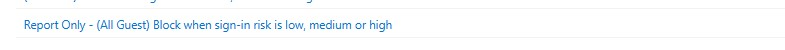

# Recommended Conditional Access Policies

# Azure AD Conditional Access Policies
_Author: Chad Cox (Microsoft)_  
_Created: January 2023_  
_Updated: February 2023_  

**Disclaimer**
_This Sample Code is provided for the purpose of illustration only and is not
intended to be used in a production environment.  THIS SAMPLE CODE AND ANY
RELATED INFORMATION ARE PROVIDED "AS IS" WITHOUT WARRANTY OF ANY KIND, EITHER
EXPRESSED OR IMPLIED, INCLUDING BUT NOT LIMITED TO THE IMPLIED WARRANTIES OF
MERCHANTABILITY AND/OR FITNESS FOR A PARTICULAR PURPOSE.  We grant You a
nonexclusive, royalty-free right to use and modify the Sample Code and to
reproduce and distribute the object code form of the Sample Code, provided
that You agree: (i) to not use Our name, logo, or trademarks to market Your
software product in which the Sample Code is embedded; (ii) to include a valid
copyright notice on Your software product in which the Sample Code is embedded;
and (iii) to indemnify, hold harmless, and defend Us and Our suppliers from and
against any claims or lawsuits, including attorneys` fees, that arise or result
from the use or distribution of the Sample Code.._   

---

**Deploy the query pack that contains all the queries from this solution into the Log Analytics Workspace that contains the Azure AD Audit / Signin logs**

[](https://portal.azure.com/#create/Microsoft.Template/uri/https%3A%2F%2Fraw.githubusercontent.com%2Fchadmcox%2FAzure_AD_Conditional_Access_Policies%2Fmain%2Fconditionalaccesspolicyimpactquerypack.json)

---

## Best Practices
 * Minimize the use of location based policies
 * Most companies do not have compliance around MacOS or Linux, In the event you do not, focus those policies on Windows.  Something is better than nothing.
 * Group based policies are great for one off requirements. Most holes exist because groups are poorly maintain and do not include all the accounts. Base policies should be focus'd on all users.
 * 

## Persona's
 * **All Users** = All Users
 * **Internal Users** = All Users Exclude Guest
 * **Privileged Role Members** = Directory Roles (Application Administrator,Authentication Administrator,Cloud Application Administrator,Conditional Access Administrator,Exchange Administrator,Global Administrator,Helpdesk Administrator,Hybrid Identity Administrator,Password Administrator,Privileged Authentication Administrator,Privileged Role Administrator,Security Administrator,SharePoint Administrator,User Administrator)
 * **Directory Sync Account** = Directory Role (Directory Sync Account)
 * **Break Glass Account** = Emergency Account that needs to be excluded from all policies
 * **Accounts Excluded** = Usually Service accounts or vault accounts that present an issue because MFA cannot be used.
 * **Azure Subscription Owners** = These are actual owners of Azure Subscriptions.

## Apps
* If not specified All Cloud Apps is required for the conditional access policies.

## Base Protection
### Require internal users to use trusted or compliant device for register security information

| Users | Cloud Apps or Actions | Conditions | Grant | Session |
| --------------------- | --------------------- | --------------------- | --------------------- | --------------------- |
| Include: All users  <br /> Exclude: BreakGlass  | User actions: register security information |  | Require Hybrid Azure AD joined device,   <br /> Require device to be marked as compliant,  <br /> Require one of the selected controls  | |  

 **Prereq:** NA

 **Comment:** This conditional access policy will require a user to be on a compliant device in order for them to be able to register MFA settings.  This could easily be swapped to require trusted location.  More than likely this will require an exclusion to make sure new users have a way to set up mfa for the first time. Only apply this to operating systems that are actually sending compliant status to Intune / Azure AD
 
 **Log Analytics Queries (KQL) against AAD Signin Logs**
 * No query put together yet.
 
---

### Require MFA for Microsoft Intune enrollment

| Users | Cloud Apps or Actions | Conditions | Grant | Session |
| --------------------- | --------------------- | --------------------- | --------------------- | --------------------- |
| Include: All users  <br /> Exclude: BreakGlass  | Include: Microsoft Intune enrollment |  | Require multifactor authentication | |  

 **Prereq:** NA

 **Comment:** This conditional access policy requires users registering a device to Intune will be prompted for a MFA.
 
 **Log Analytics Queries (KQL) against AAD Signin Logs**
  * [Possible impact for users required MFA for Microsoft intune Enrollement](https://github.com/chadmcox/Azure_Active_Directory/blob/master/Log%20Analytics/Conditional%20Access%20Policy/User%20Scenerios/Possible%20impact%20for%20users%20required%20MFA%20for%20Microsoft%20intune%20Enrollement.kql)

---

### Require MFA for device enrollment

| Users | Cloud Apps or Actions | Conditions | Grant | Session |
| --------------------- | --------------------- | --------------------- | --------------------- | --------------------- |
| Include: All users  <br /> Exclude: BreakGlass  | User actions: Register or join device  |  | Require multifactor authentication | |  

 **Prereq:** NA

 **Comment:** This condition access policy requires user's to provide mfa when registering devices to Azure AD.
 
 **Log Analytics Queries (KQL) against AAD Signin Logs**
  * [Possible impact if all users required to mfa when registering devices](https://github.com/chadmcox/Azure_Active_Directory/blob/master/Log%20Analytics/Conditional%20Access%20Policy/User%20Scenerios/Possible%20impact%20if%20all%20users%20required%20to%20mfa%20when%20registering%20devices.kql)

---

### Require MFA for all guest

| Users | Cloud Apps or Actions | Conditions | Grant | Session |
| --------------------- | --------------------- | --------------------- | --------------------- | --------------------- |
| Include: Guest  <br /> Exclude: BreakGlass  | Include: All Cloud Apps  |  | Require multifactor authentication | |  

 **Prereq:** NA

 **Comment:** This conditional access policy requires guest to MFA when accessing resources.
 
 **Log Analytics Queries (KQL) against AAD Signin Logs**
  * [Find possible guest impact if required MFA](https://github.com/chadmcox/Azure_Active_Directory/blob/master/Log%20Analytics/Conditional%20Access%20Policy/Guest%20Scenerios/Find%20possible%20guest%20impact%20if%20required%20MFA.kql)

---

### Require MFA for privileged role members

| Users | Cloud Apps or Actions | Conditions | Grant | Session |
| --------------------- | --------------------- | --------------------- | --------------------- | --------------------- |
| Include: Role - privileged roles  <br /> Exclude: BreakGlass  | Include: All Cloud Apps  |  | Require multifactor authentication | |  

 **Prereq:** Run the following script to retrieve a list of admin accounts to put into the query. [RetrieveAdminsforKQL.ps1](https://raw.githubusercontent.com/chadmcox/Azure_Active_Directory/master/PIM/RetrieveAdminsforKQL.ps1)

 **Comment:**
 
 **Log Analytics Queries (KQL) against AAD Signin Logs**
  * [Find possible impact if privileged role members are required to MFA](https://github.com/chadmcox/Azure_Active_Directory/blob/master/Log%20Analytics/Conditional%20Access%20Policy/Privileged%20Role%20Members/Find%20possible%20impact%20if%20privileged%20role%20members%20are%20required%20to%20MFA.kql)
  * [Using PIM activates find possible impact if privileged role members are require to mfa](https://github.com/chadmcox/Azure_Active_Directory/blob/master/Log%20Analytics/Conditional%20Access%20Policy/Privileged%20Role%20Members/Using%20PIM%20activates%20find%20possible%20impact%20if%20privileged%20role%20members%20are%20require%20to%20mfa.kql)
  * [Using Sentinel UEMA Logs find possible impact if privileged role members are required to mfa](https://github.com/chadmcox/Azure_Active_Directory/blob/master/Log%20Analytics/Conditional%20Access%20Policy/Privileged%20Role%20Members/Using%20Sentinel%20UEMA%20Logs%20find%20possible%20impact%20if%20privileged%20role%20members%20are%20required%20to%20mfa.kql)
 
---

### Require internal users to use compliant or trusted device for office 365

| Users | Cloud Apps or Actions | Conditions | Grant | Session |
| --------------------- | --------------------- | --------------------- | --------------------- | --------------------- |
| Include: All users  <br /> Exclude: Guest,BreakGlass  | Include: Office 365  | | Require Hybrid Azure AD joined device,   <br /> Require device to be marked as compliant,  <br /> Require one of the selected controls  | |  

 **Prereq:** 

 **Comment:**
 
 **Log Analytics Queries (KQL) against AAD Signin Logs**

---

### Require MFA for internal users from non trusted location

| Users | Cloud Apps or Actions | Conditions | Grant | Session |
| --------------------- | --------------------- | --------------------- | --------------------- | --------------------- |
| Include: All users  <br /> Exclude: Guest,BreakGlass  | Include: All Cloud Apps  | Include: Any location  <br /> Excluded: All trusted locations | Require multifactor authentication | |  

 **Prereq:** Requires all known internet egresses to be defined as a trusted network. [Get list of potential trusted ips](https://github.com/chadmcox/Azure_Active_Directory/blob/master/Log%20Analytics/Conditional%20Access%20Policy/Network%20Locations/Get%20list%20of%20potential%20trusted%20ips.kql)

 **Comment:**
 
 **Log Analytics Queries (KQL) against AAD Signin Logs**

---

### Require privileged role member to use compliant device

| Users | Cloud Apps or Actions | Conditions | Grant | Session |
| --------------------- | --------------------- | --------------------- | --------------------- | --------------------- |
| Include: Role - privileged roles  <br /> Exclude: BreakGlass  | Include: All Cloud Apps  |  | Require device to be marked as compliant | |  

 **Prereq:**

 **Comment:**
 
 **Log Analytics Queries (KQL) against AAD Signin Logs**

---

### Require MFA for Azure Subscription Owners

| Users | Cloud Apps or Actions | Conditions | Grant | Session |
| --------------------- | --------------------- | --------------------- | --------------------- | --------------------- |
| Include: Subscription Owner Group  <br /> Exclude: BreakGlass  | Include: All Cloud Apps  |  | Require multifactor authentication | |  

 **Prereq:** need to get list of all subscription owners put in a group

 **Comment:**
 
 **Log Analytics Queries (KQL) against AAD Signin Logs**
 
---

### Require MFA for all users when accessing Microsoft Management Endpoints

| Users | Cloud Apps or Actions | Conditions | Grant | Session |
| --------------------- | --------------------- | --------------------- | --------------------- | --------------------- |
| Include: All Users  <br /> Exclude: BreakGlass  | Include: Microsoft Intune,   <br />  Microsoft Azure Management,   <br /> Microsoft Graph PowerShell,   <br /> Graph Explorer  |  | Require multifactor authentication | |  

 **Prereq:**

 **Comment:**
 
 **Log Analytics Queries (KQL) against AAD Signin Logs**
 
---

## Identity Protection
### Block all users when user risk is high

| Users | Cloud Apps or Actions | Conditions | Grant | Session |
| --------------------- | --------------------- | --------------------- | --------------------- | --------------------- |
| Include: All Users  <br /> Exclude: BreakGlass  | Include: All Cloud Apps  | User Risk: high | Block | |  

 **Prereq:**

 **Comment:**
 
 **Log Analytics Queries (KQL) against AAD Signin Logs**
 
---

### Block all users when sign-in risk is high

| Users | Cloud Apps or Actions | Conditions | Grant | Session |
| --------------------- | --------------------- | --------------------- | --------------------- | --------------------- |
| Include: All Users  <br /> Exclude: BreakGlass  | Include: All Cloud Apps  | Sign-in Risk: high | Block | |  

 **Prereq:**

 **Comment:**
 
 **Log Analytics Queries (KQL) against AAD Signin Logs**
 
---

### Block privileged role members when sign-in risk is low, medium and high

| Users | Cloud Apps or Actions | Conditions | Grant | Session |
| --------------------- | --------------------- | --------------------- | --------------------- | --------------------- |
| Include: Role - privileged roles   <br /> Exclude: BreakGlass  | Include: All Cloud Apps  | Sign-in Risk: low, medium, high | Block | |  

 **Prereq:**

 **Comment:**
 
 **Log Analytics Queries (KQL) against AAD Signin Logs**
 
---

### Block privileged role members when user risk is low, medium and high

| Users | Cloud Apps or Actions | Conditions | Grant | Session |
| --------------------- | --------------------- | --------------------- | --------------------- | --------------------- |
| Include: Role - privileged roles   <br /> Exclude: BreakGlass  | Include: All Cloud Apps  | User Risk: low, medium, high | Block | |  

 **Prereq:**

 **Comment:**
 
 **Log Analytics Queries (KQL) against AAD Signin Logs**
 
---

### Block all users access to Microsoft Azure Management, Microsoft Graph PowerShell and Graph Explorer when sign-in risk is low, medium and high

| Users | Cloud Apps or Actions | Conditions | Grant | Session |
| --------------------- | --------------------- | --------------------- | --------------------- | --------------------- |
| Include: All users <br /> Exclude: BreakGlass  | Include: Microsoft Azure Management, Microsoft Graph PowerShel,Graph Explorer | Sign-in Risk low, medium, high | Block | |  

 **Prereq:**

 **Comment:**
 
 **Log Analytics Queries (KQL) against AAD Signin Logs**
 
---

### Block directory sync account when sign in risk is low, medium and high

| Users | Cloud Apps or Actions | Conditions | Grant | Session |
| --------------------- | --------------------- | --------------------- | --------------------- | --------------------- |
| Include: Role - directory sync account   <br /> Exclude: BreakGlass  | Include: All Cloud Apps  | Sign-in Risk: low, medium, high | Block | |  

 **Prereq:**

 **Comment:**
 
 **Log Analytics Queries (KQL) against AAD Signin Logs**
 
---

### Block internal users from register security information when sign in risk is low, medium and high

| Users | Cloud Apps or Actions | Conditions | Grant | Session |
| --------------------- | --------------------- | --------------------- | --------------------- | --------------------- |
| Include: All Users   <br /> Exclude: Guest, BreakGlass  | User actions: register security information  | Sign-in Risk: low, medium, high | Block | |  

 **Prereq:**

 **Comment:**
 
 **Log Analytics Queries (KQL) against AAD Signin Logs**
 
---

## Data Protection

### Restrict guest to less than 8 hour session limit

| Users | Cloud Apps or Actions | Conditions | Grant | Session |
| --------------------- | --------------------- | --------------------- | --------------------- | --------------------- |
| Include: Guest   <br /> Exclude: BreakGlass  | Include: All Cloud Apps  |  |  | Sign-in frequency = 8 Hour |  

 **Prereq:**

 **Comment:**
 
 **Log Analytics Queries (KQL) against AAD Signin Logs**
 
---

### Restrict privileged role members to less than 8 hour session limit

| Users | Cloud Apps or Actions | Conditions | Grant | Session |
| --------------------- | --------------------- | --------------------- | --------------------- | --------------------- |
| Include: Role - privileged roles   <br /> Exclude: BreakGlass  | Include: All Cloud Apps  |  |  | Sign-in frequency = 8 Hour |  

 **Prereq:**

 **Comment:**
 
 **Log Analytics Queries (KQL) against AAD Signin Logs**
 
---

### Restrict internal users using nontrusted or noncompliant device to 1 hour session limit

| Users | Cloud Apps or Actions | Conditions | Grant | Session |
| --------------------- | --------------------- | --------------------- | --------------------- | --------------------- |
| Include: All Users  <br /> Exclude: Guest, BreakGlass  | Include: All Cloud Apps  | Filter for devices Include: device.isCompliant -ne True -or device.trustType -ne "ServerAD" |  | Sign-in frequency = 1 Hour |  

 **Prereq:**

 **Comment:**
 
 **Log Analytics Queries (KQL) against AAD Signin Logs**
 
---

### Restrict internal users using nontrusted or noncompliant device to no persistent browser session

| Users | Cloud Apps or Actions | Conditions | Grant | Session |
| --------------------- | --------------------- | --------------------- | --------------------- | --------------------- |
| Include: All Users  <br /> Exclude: Guest, BreakGlass  | Include: All Cloud Apps  | Client Apps Include: Browser <br /> Filter for devices Include: device.isCompliant -ne True -or device.trustType -ne "ServerAD" |  | Persistent browser session = Never persistent |  

 **Prereq:**

 **Comment:**
 
 **Log Analytics Queries (KQL) against AAD Signin Logs**
 
---

### Block guest from using mobile apps and desktop apps

| Users | Cloud Apps or Actions | Conditions | Grant | Session |
| --------------------- | --------------------- | --------------------- | --------------------- | --------------------- |
| Include: Guests  <br /> Exclude: BreakGlass  | Include: All Cloud Apps  | Include: Mobile apps and desktop clients  | Block |  |  

 **Prereq:**

 **Comment:**
 
 **Log Analytics Queries (KQL) against AAD Signin Logs**
 
---

## Attack Surface Reduction  

### Block all users legacy authentication  

| Users | Cloud Apps or Actions | Conditions | Grant | Session |
| --------------------- | --------------------- | --------------------- | --------------------- | --------------------- |
| Include: All Users  <br /> Exclude: BreakGlass  | Include: All Cloud Apps  | Include: Exchange ActiveSync clients,Other clients  | Block |  |  

 **Prereq:**

 **Comment:**
 
 **Log Analytics Queries (KQL) against AAD Signin Logs**
 
---
 
### Block privileged role members legacy authentication 
 
| Users | Cloud Apps or Actions | Conditions | Grant | Session |
| --------------------- | --------------------- | --------------------- | --------------------- | --------------------- |
| Include: Role - privileged roles  <br /> Exclude: BreakGlass  | Include: All Cloud Apps  | Include: Exchange ActiveSync clients,Other clients  | Block |  |  

 **Prereq:**

 **Comment:**
 
 **Log Analytics Queries (KQL) against AAD Signin Logs**
 
---
 
### Block privileged role members from unsupported platforms.  

| Users | Cloud Apps or Actions | Conditions | Grant | Session |
| --------------------- | --------------------- | --------------------- | --------------------- | --------------------- |
| Include: Role - privileged roles  <br /> Exclude: BreakGlass  | Include: All Cloud Apps  | Include: Linux | Block |  |  

 **Prereq:**

 **Comment:**
 
 **Log Analytics Queries (KQL) against AAD Signin Logs**
 
---

### Block all users access from tor exit nodes  

| Users | Cloud Apps or Actions | Conditions | Grant | Session |
| --------------------- | --------------------- | --------------------- | --------------------- | --------------------- |
| Include: All Users  <br /> Exclude: BreakGlass  | Include: All Cloud Apps  | Include: Tor Nodes | Block |  |  
 
 **Prereq:** Define all the tor exit nodes and any other set of IP's that need to be blocked. [link to Tor IP list](https://raw.githubusercontent.com/SecOps-Institute/Tor-IP-Addresses/master/tor-exit-nodes.lst)
 
 **Comment:**
 
 **Log Analytics Queries (KQL) against AAD Signin Logs**
  * [Possible impact if tor exit nodes are blocked](https://github.com/chadmcox/Azure_Active_Directory/blob/master/Log%20Analytics/query-SigninsfromKnownTorExitNodes.kql)
 
---

### Block guest access from unexpected countries

| Users | Cloud Apps or Actions | Conditions | Grant | Session |
| --------------------- | --------------------- | --------------------- | --------------------- | --------------------- |
| Include: Guest  <br /> Exclude: BreakGlass  | Include: All Cloud Apps  | Include: Unapproved Countries | Block |  |

**Prereq:** Country locations should be defined with countries guest users should not be signing in from.  

**Comment:** This Conditional Access Policies are used to block guest from accessing an application from countries for example Russia where Business may not be allowed.

**Log Analytics Queries (KQL) against AAD Signin Logs**
 * [Get list of countries guest are signing in from](https://github.com/chadmcox/Azure_Active_Directory/blob/master/Log%20Analytics/Conditional%20Access%20Policy/Guest%20Scenerios/Get%20list%20of%20countries%20guest%20are%20signing%20in%20from.kql)

---

### Block guest access to non-approved apps

| Users | Cloud Apps or Actions | Conditions | Grant | Session |
| --------------------- | --------------------- | --------------------- | --------------------- | --------------------- |
| Include: guest  <br /> Exclude: BreakGlass  | Include: All Cloud Apps  <br /> Excluded: Office 365, Other B2B approved apps |  | Block |  |

**Prereq:**  

**Comment:** This Conditional Access Policy is used to make sure guest (external B2B) are only allowed to access applications they need access to.  This examples blocks everything but Office 365 so that teams and sharepoint collaberation can continue to work.  **Guest should be blocked from things like Microsoft Azure Management, Microsoft Graph PowerShell, Microsoft Graph Explorer, VPNs, and HR Apps.**  

**Log Analytics Queries (KQL) against AAD Signin Logs**
 * [Find possible guest impact by blocking Graph Explorer and MS Graph PowerShell](https://github.com/chadmcox/Azure_Active_Directory/blob/master/Log%20Analytics/Conditional%20Access%20Policy/Guest%20Scenerios/Find%20possible%20guest%20impact%20by%20blocking%20Graph%20Explorer%20and%20MS%20Graph%20PowerShell.kql)
 * [Find possible guest impact by blocking Microsoft Azure Management](https://github.com/chadmcox/Azure_Active_Directory/blob/master/Log%20Analytics/Conditional%20Access%20Policy/Guest%20Scenerios/Find%20possible%20guest%20impact%20by%20blocking%20Microsoft%20Azure%20Management.kql)
 * [Get list of applications guest are successfully logging into](https://github.com/chadmcox/Azure_Active_Directory/blob/master/Log%20Analytics/Conditional%20Access%20Policy/Guest%20Scenerios/Get%20list%20of%20applications%20guest%20are%20successfully%20logging%20into.kql)

---
### Block privileged role members from countries except US (other acceptable countries)

| Users | Cloud Apps or Actions | Conditions | Grant | Session |
| --------------------- | --------------------- | --------------------- | --------------------- | --------------------- |
| Include: Role - privileged roles  <br /> Exclude: BreakGlass  | Include: All Cloud Apps  | Include: All Networks  <br /> Exclude: Trusted Countries | Block |  |

**Prereq:** Country locations should be defined with countries privileged roles members are located.  

**Comment:** This Conditional Access Policy is to force the privileged roles to only allow signing in from countries where these users are located in.  The goal is to prevent a global admin account from logging in from a country for example Russia where there are more than likely no administrators located.

**Log Analytics Queries (KQL) against AAD Signin Logs**  
 * [Using PIM activates find countries privileged role members are logging in from](https://github.com/chadmcox/Azure_Active_Directory/blob/master/Log%20Analytics/Conditional%20Access%20Policy/Privileged%20Role%20Members/Using%20PIM%20activates%20find%20countries%20privileged%20role%20members%20are%20logging%20in%20from.kql)

---

### Block directory sync account from non trusted location

| Users | Cloud Apps or Actions | Conditions | Grant | Session |
| --------------------- | --------------------- | --------------------- | --------------------- | --------------------- |
| Include: Role - directory sync account  <br /> Exclude: BreakGlass  | Include: All Cloud Apps  | Include: All Networks  <br /> Exclude: Trusted Networks | Block |  |

**Prereq:** Trusted Locations (IP Ranges) should be defined.  

**Comment:** This Conditional Access Policy is used to make sure if the credentials for the directory sync account are stolen that they cannot be accessed outside of the trusted network.  

**Log Analytics Queries (KQL) against AAD Signin Logs**  
* [Find possible Directory Sync Account impact if blocked from untrusted network](https://github.com/chadmcox/Azure_Active_Directory/blob/master/Log%20Analytics/Conditional%20Access%20Policy/Privileged%20Role%20Members/Find%20possible%20Directory%20Sync%20Account%20impact%20if%20blocked%20from%20untrusted%20network.kql)

---

### Block accounts excluded from require MFA policies from non trusted location

| Users | Cloud Apps or Actions | Conditions | Grant | Session |
| --------------------- | --------------------- | --------------------- | --------------------- | --------------------- |
| Include: (Group of excluded users) <br /> Exclude: BreakGlass  | Include: All Cloud Apps  | Include: All Networks  <br /> Exclude: Trusted Networks | Block |  |

**Prereq:** Trusted Locations (IP Ranges) should be defined.  

**Comment:** This Conditional Access Policy is used to make sure accounts excluded from requiring MFA should be required to authenticate from trusted locations. Link below contains the script that can be used to scan all the conditional access policy exclusions and return a list of accounts that should be in this list.  Do not include the breakglass account.
 * [Link to PowerShell script](https://github.com/chadmcox/Azure_Active_Directory/blob/master/Conditional%20Access%20Policy/exportConditionalAccessExclusions.ps1)

## Compliance
 * Require TOU for Guest

## Notes
### How to run a Log Analytics Query
* In the Azure AD Portal
* Navigate to the Log Analytics Tab
* Copy the example code from the section you want to review the possible impact
* Replace the existing text in the query window or open a new query tab and paste in the new one.
* Then select Run and wait for the results.  

   

**Or Deploy the query pack that contains all the queries from this solution into the Log Analytics Workspace that contains the Azure AD Audit / Signin logs**

[](https://portal.azure.com/#create/Microsoft.Template/uri/https%3A%2F%2Fraw.githubusercontent.com%2Fchadmcox%2FAzure_AD_Conditional_Access_Policies%2Fmain%2Fconditionalaccesspolicyimpactquerypack.json)

* After the query pack is deployed
* In the Azure AD Portal
* Navigate to the Log Analytics Tab
* Select the Queries and change the group by to Label

  

---

### Import the policies from templates
I have put together a script that will import all of the policies from this github.   
The scipt can be found here [click here](https://raw.githubusercontent.com/chadmcox/Azure_Active_Directory/master/Conditional%20Access%20Policy/Import-AADRecommendedConditionalAccessPolicies.ps1)   

**Instructions**   
* Copy the contents of the script locally onto a machine.
* Run the script in PowerShell
* Select the number of the policy you want to import.
* Review the results They are always in read-only and have a prefix

_Import menu_   
 

_finished policy_   
   


---

### Create list of privileged users for the kql designed to search for privileged user impact  

* Run this in PowerShell
```
Connect-MgGraph
Select-MgProfile -Name beta
$roles = @("Application Administrator","Authentication Administrator","Cloud Application Administrator","Conditional Access Administrator","Exchange Administrator","Global Administrator","Helpdesk Administrator","Hybrid Identity Administrator","Password Administrator","Privileged Authentication Administrator","Privileged Role Administrator","Security Administrator","SharePoint Administrator","User Administrator")
(Get-MgDirectoryRole -ExpandProperty members -all | where {$_.displayname -In $roles} | select -ExpandProperty members).id  -join('","') | out-file .\privuser.txt
```
* The results of this will be in a file called privuser.txt
* Open the txt file.  Should look something like this
```
8f47d5a6-a36b-4d99-b6bc-c023cf23ae9b","8f47d5a6-a36b-4d99-b6bc-c023cf23ae9b","8f47d5a6-a36b-4d99-b6bc-c023cf23ae9b","8f47d5a6-a36b-4d99-b6bc-c023cf23ae9b","8f47d5a6-a36b-4d99-b6bc-c023cf23ae9b","8f47d5a6-a36b-4d99-b6bc-c023cf23ae9b
```
* Next in the sections titled **Log Analytics AAD SigninLogs Query (KQL) needs results from the PowerShell script** from the section you are reviewing.  Will want to copy the kql statement, and paste in Log Analytics.
* on line 1 replace the phrase **replace this with the results from the privuser.txt found from the powershell cmdlets** 
```
let privusers = pack_array("**replace this with the results from the privuser.txt found from the powershell cmdlets**");
```
* to look like
```
let privusers = pack_array("8f47d5a6-a36b-4d99-b6bc-c023cf23ae9b","8f47d5a6-a36b-4d99-b6bc-c023cf23ae9b","8f47d5a6-a36b-4d99-b6bc-c023cf23ae9b","8f47d5a6-a36b-4d99-b6bc-c023cf23ae9b","8f47d5a6-a36b-4d99-b6bc-c023cf23ae9b","8f47d5a6-a36b-4d99-b6bc-c023cf23ae9b");
```

---


### Find IPAddress not defined as trusted
**Log Analytics AAD SigninLogs Query (KQL)**
```
SigninLogs
| where TimeGenerated > ago(30d)
| where ResultType == "0"
| where HomeTenantId == ResourceTenantId
| where NetworkLocationDetails !contains "trustedNamedLocation"
| extend TrustedLocation = tostring(iff(NetworkLocationDetails contains 'trustedNamedLocation', 'trustedNamedLocation',''))
| extend isIPv6 = tostring(iff(IPAddress matches regex @"(([\d|\w]{1,4}\:){7}[\d|\w]{1,4})",'Yes','No'))
| distinct IPAddress, TrustedLocation, UserPrincipalName, isIPv6
| summarize uniqueusercountbyip = count() by IPAddress, TrustedLocation, isIPv6
| where uniqueusercountbyip >= 4
| sort by uniqueusercountbyip desc 
```

**Comment**  

This query returns IP addresses where 4 or more unique users have authenticated against Azure AD.  You will want to research each IP and determine if they are owned by the organization or if they belong to something like a public proxy cloud solution like zscaler or umbrella.  Legit ones will need to be defined as a trusted network in Azure AD to make sure any location filtered policy works correctly and to help remediate false positives in Azure Identity Protection

Instructions on how to create named locations can be viewed here [Named locations](https://learn.microsoft.com/en-us/azure/active-directory/conditional-access/location-condition#named-locations)   

The field uniqueusercountbyip is count of unique list of users. It is possible to see ipv6 addresses which usually comes from Azure Networks and will be normal in the near future from the internet.

   

---
### Applications not being protected by Conditional Access Policies
**Log Analytics AAD SigninLogs Query (KQL)**
```
//https://github.com/reprise99/Sentinel-Queries/blob/main/Azure%20Active%20Directory/Identity-Top20AppswithnoCA.kql
//This query shows applications that are not protected by conditional access policies.
let apps=
    SigninLogs
    | where TimeGenerated > ago (30d)
    | project TimeGenerated, ConditionalAccessPolicies, AppDisplayName
//Exclude native Microsoft apps that you can't enforce policy on or that are covered natively in Office 365
    | where AppDisplayName !in ("Microsoft Office Web Apps Service", "Microsoft App Access Panel", "Office Online Core SSO", "Microsoft Authentication Broker", "Microsoft Account Controls V2", "Microsoft 365 Support Service","Office Online Maker SSO","My Apps","My Profile")
    | mv-expand ConditionalAccessPolicies
    | extend CAResult = tostring(ConditionalAccessPolicies.result)
    | summarize ResultSet=make_set(CAResult) by AppDisplayName
    | where ResultSet !has "success" or ResultSet !has "failure"
    | project AppDisplayName;
SigninLogs
| where TimeGenerated > ago(30d)
| where ResultType == 0
| where AppDisplayName in (apps)
| summarize Count=count()by AppDisplayName
| top 20 by Count

```

**Comment**  
The image below, shows the applications and the logon count of those apps that is not being protected by some sort of Conditional Access Policy. Ideally every application will have a mfa requirement or a trusted/compliant policy requirement.  

   

## References
